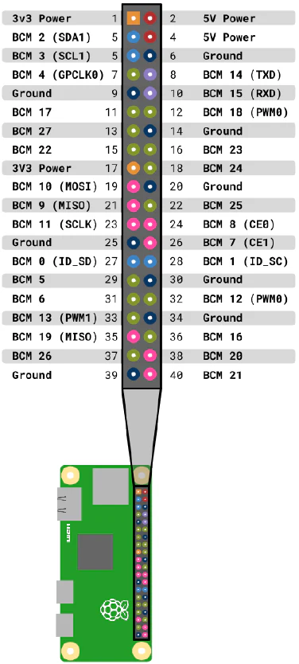

# rpizw-weather-station
A RPi Zero W weather station (T, RH) based on a [SHT3x](https://sensirion.com/media/documents/213E6A3B/63A5A569/Datasheet_SHT3x_DIS.pdf) sensor

## Goal
- Measure the temperature and humidity
- Write informations on a CSV file
- Make the CSV downloadable through a HTTP server

## Set Up
- Connect sensor to 3.3 V, I2C_1 and GND (pins: 1, 3, 5, 6)

- Build the content of the [C](C/) folder (run ```make```)
- To run the program at startup, write the *run command* in ```/etc/rc.local``` (e.g.: add ```./path/to/rpizw-weather-station``` in the file, before ```exit 0```)
- Install Apache2 & PHP
- Move the content of the [server](server/) folder to ```/var/www/html```
- **Done**, you can access the download page from the local IP of the Raspberry (run ```ifconfig``` to get the IP)

## References
[SHT3x](https://sensirion.com/media/documents/213E6A3B/63A5A569/Datasheet_SHT3x_DIS.pdf)\
[RPi Zero Pinout & I2C set up](https://maxbotix.com/blogs/blog/setup-raspberry-pi-zero-for-i2c-sensor?srsltid=AfmBOopnYwyfIVwbREWUC6SEFS_9hnKsjXe6jiMuqJ6fLdvU5X4HxmWB)\
[RPi: boot without login](https://forums.raspberrypi.com/viewtopic.php?t=71690)\
[RPi: I2C interface C documentation](https://www.kernel.org/doc/Documentation/i2c/dev-interface)\
[TI understanding the I2C bus document](https://www.ti.com/lit/an/slva704/slva704.pdf?ts=1728082854342&ref_url=https%253A%252F%252Fwww.google.com%252F)\
[Install a web server on RPi (french)](https://raspberry-pi.fr/installer-serveur-web-raspberry-lamp/)\

## License
MIT License. See [LICENSE](LICENSE) file.